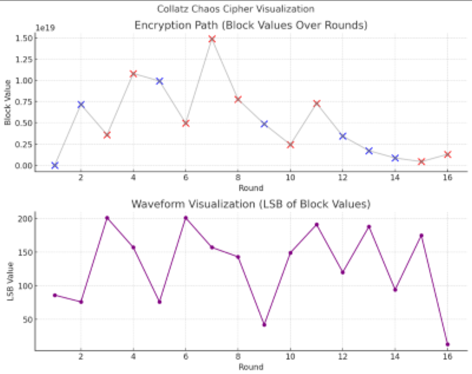

# 🌀 Collatz Chaos Cipher

Welcome to the **Collatz Chaos Cipher**, a curiosity-driven encryption experiment inspired by the Collatz Conjecture, which explores the intersection of mathematics, chaos theory, and signal processing. This project implements a reversible block cipher inspired by the famous 3x+1 Collatz function, extended with signal spiral dynamics.

Unlike conventional ciphers, this one leverages chaotic iteration and non-linear key transformations to produce unpredictable, avalanche-prone encrypted outputs. Alongside the core algorithm, the repository includes visualization tools to animate bit diffusion and waveform transformations during encryption rounds.

This repository is ideal for cryptographers, mathematicians, chaos enthusiasts, and curious minds interested in experimental encryption techniques that are not yet suitable for production use.
#
#
### ✨ Features

- 🔐 Chaotic block cipher built from 3x+1 logic, signal spirals, and entropy mutations  
- 🔄 Reversible encryption using a chaotic 3x+1 float function  
- 🌀 Signal spiral logic with non-linear key influence  
- 🎞️ Real-time visualizer for bit diffusion across rounds  
- 📈 Avalanche test harness and entropy tracker  
- 🧠 Academic journal + call for cryptanalysis contributions  
- 🖼️ Branded logo + real chaos spiral (SVG/PNG)  
#
#
### 🔬 Intended For

- Cryptographers, theorists, and chaos enthusiasts  
- Anyone exploring the intersection of math, signals, and encryption  
- Curious minds interested in experimental cryptography (NOT production-ready!)
#
#
### ⚠️ Important Disclaimer

For educational and experimental purposes only! This is **NOT** secure encryption.  
It’s a toy example demonstrating how a Collatz-inspired iterative function can be used as a pseudorandom transform.
#
#
### 🧪 Running Tests

First-time setup (required once):

Make the test script executable by running:

bash

cd path/to/collatz_chaos_cipher
chmod +x run_tests.sh
#
After that, to execute all tests in one step, you can run:

bash

./run_tests.sh
#
To verify the correctness of the cipher, automated unit tests are included. Run them from the project root directory using:

bash

python -m unittest test_vectors.py
#
Or use the provided test runner script:

bash

./run_tests.sh
#
#
“What looks like madness may just be an orbit not yet closed.”

This fractal, generated from a Collatz-like function extended into the complex plane, represents the chaotic seed behind the Collatz Chaos Cipher. 

#
#
Here's a visualization of the non-integer Collatz-like trajectories. 

Each line represents how a different non-integer starting value evolves under the (even: x/2, odd: (3x+1)/2) rule. You can see chaotic decay patterns that hint at sensitive dependence on initial conditions, a hallmark of complex dynamical systems.

#
#
Here is a visualization of the Collatz Chaos Cipher in action:

Top Plot: Shows how the block value evolves over 16 rounds of encryption. Blue points represent even rounds, and red points represent odd rounds based on the block parity.

Bottom Plot: Displays the least significant byte (LSB) from each round, forming a waveform that captures bit-level transformations.

This dual-view helps illustrate the cipher's nonlinear behavior and bit-level diffusion.

#
#
Explore the chaos. Encrypt with curves. Challenge convention.
